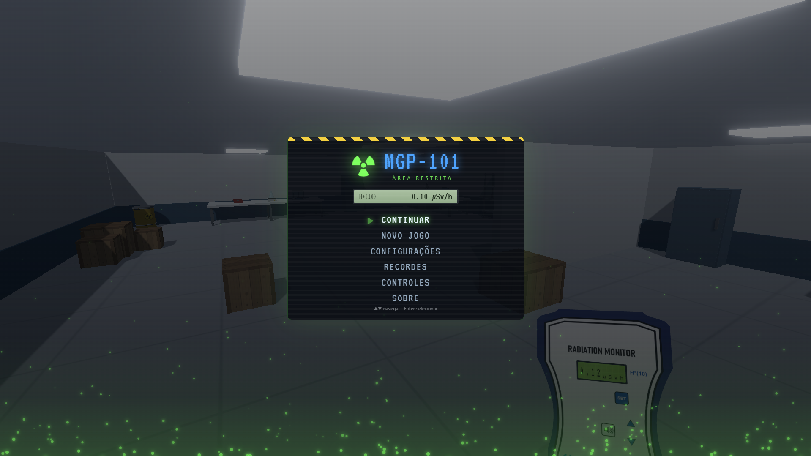

<div align="center">

# ☢ MGP-101: ÁREA RESTRITA

**Jogo em primeira pessoa de exploração e detecção de radiação, desenvolvido em JavaScript e Three.js.**

[](https://developer.mozilla.org/docs/Web/JavaScript)
[](https://threejs.org/)
[](https://vite.dev/)

### [▶ JOGAR AGORA](https://radinstruments.com.br/game/)

[Sobre](#sobre-o-jogo) · [Demonstração](#demonstração) · [Instalação](#instalação-e-execução-local) · [Controles](#controles)

</div>

---

## Sobre o jogo

O jogador investiga um laboratório, interpreta o monitor MGP-101, usa distância e blindagem para reduzir a exposição e localiza fontes radioativas procedurais antes de ultrapassar os limites da missão.

O jogo pode ser acessado diretamente em **[https://radinstruments.com.br/game/](https://radinstruments.com.br/game/)**.

## Características

- Campanha com 13 fases, incluindo evacuação final.
- Quatro isótopos com respostas diferentes à blindagem.
- Campo de radiação e dose baseados em distância, intensidade e transmissão.
- Monitor MGP-101 em primeira pessoa com LCD emulado.
- Teclado, mouse e controles Xbox pela Gamepad API.
- Três slots de campanha, configurações e recordes locais.
- Qualidade gráfica adaptativa e pós-processamento com bloom.

## Demonstração

### Capturas de tela

<p align="center">
  <a href="docs/media/screenshots/menu-principal.png">
    
  </a>
</p>

<p align="center"><em>Menu principal do MGP-101: Área Restrita</em></p>

### Vídeo de gameplay

<p align="center">
  <a href="docs/media/gameplay.gif">
    
  </a>
</p>

<p align="center"><em>Exploração e detecção de radiação durante uma missão</em></p>

## Tecnologias

- JavaScript com ES Modules
- Three.js `0.160.0`
- Vite

Ao selecionar **CONTINUAR** na tela de boot, o jogo solicita o modo de tela cheia. Se o navegador ou o host bloquear essa permissão, o menu abre normalmente em modo janela.

## Instalação e execução local

### Pré-requisitos

- [Git](https://git-scm.com/)
- Node.js 24 ou uma versão compatível com o Vite 8
- Navegador com suporte a WebGL e ES Modules

### Instalação

```bash
git clone https://github.com/luancesarcode/mgp101-area-restrita.git
cd mgp101-area-restrita
npm install
```

### Iniciar o jogo

```bash
npm run dev
```

Abra o endereço exibido pelo Vite no terminal. O projeto deve ser executado por HTTP; não abra `index.html` por duplo clique, pois navegadores restringem módulos carregados por `file://`.

## Controles

| Ação | Teclado e mouse | Controle Xbox |
|---|---|---|
| Movimento | `WASD` | Analógico esquerdo |
| Câmera | Mouse | Analógico direito |
| Correr | `Shift` | Clique no analógico esquerdo |
| Pular | `Espaço` | `A` |
| Agachar | `Ctrl` | `B` |
| Interagir/manipular | `F` | `X` |
| Pausar | `Esc` | Menu |

Os controles completos de manipulação de objetos continuam disponíveis dentro do próprio jogo.

## Licença

O código-fonte está disponível sob a [Licença MIT](LICENSE), com direitos
autorais atribuídos a Luan César.

As músicas, efeitos sonoros, imagens, vídeos, logotipos e demais recursos de
mídia não fazem parte da licença MIT. Esses materiais permanecem com
[Todos os Direitos Reservados](ASSETS-LICENSE.md).

---

<div align="center">

Desenvolvido com JavaScript e Three.js para a **RAD Instruments**.

[Jogar online](https://radinstruments.com.br/game/) · [Reportar problema](https://github.com/luancesarcode/mgp101-area-restrita/issues)

</div>
